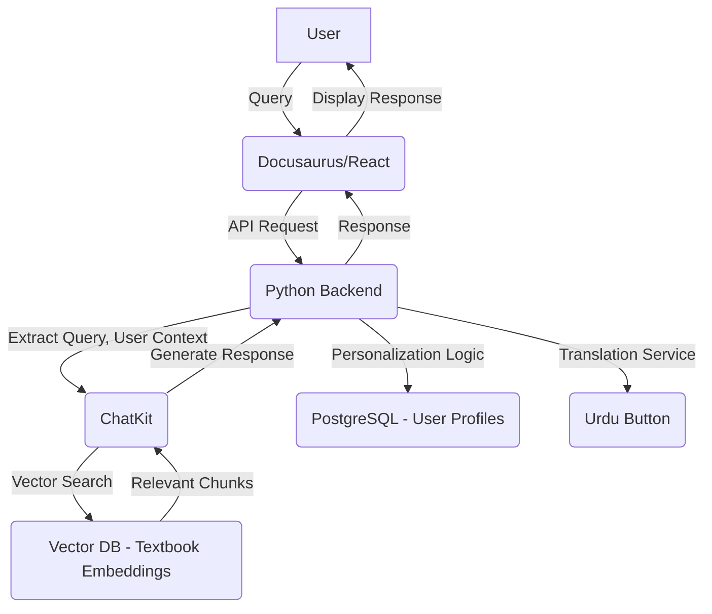

<!--
Sync Impact Report:
Version change: 1.0.0 → 1.0.1
Modified principles: None (minor update)
Added sections: None
Removed sections: None
Templates requiring updates:
- .specify/templates/plan-template.md: ✅ updated
- .specify/templates/spec-template.md: ✅ updated
- .specify/templates/tasks-template.md: ✅ updated
- .specify/templates/commands/sp.constitution.md: ⚠ pending (file does not exist, not applicable)
Follow-up TODOs: None
-->
# Physical AI & Humanoid Robotics AI-Native Textbook + Intelligent Learning Platform Constitution

## Core Principles

### I. Educational Excellence
Prioritize clear, comprehensive, and engaging content for the Docusaurus-based textbook on Physical AI & Humanoid Robotics. Ensure pedagogical soundness and practical relevance, covering ROS 2, Digital Twins, AI-Robot Brains, and Vision-Language-Action (VLA).

### II. AI-Native Platform Integration
Develop a robust RAG chatbot using OpenAI Agents/ChatKit, FastAPI, Neon DB, and Qdrant cloud, seamlessly integrated with the textbook. The platform must offer intelligent learning support and enhance the educational experience.

### III. User-Centric Design & Accessibility
Implement personalization features based on user background and provide multilingual translation, including an Urdu language option. The platform must be inclusive and adaptable to diverse learner needs.

### IV. Agentic AI & Reusability
Design the platform to support Claude Code Subagents and foster the creation of reusable Agent Skills. Emphasize modularity, extensibility, and the advancement of AI-driven development practices.

### V. Ethical & Safe AI Development
Adhere to strict ethical and safety guidelines in all aspects of humanoid robotics and AI development, ensuring responsible innovation and mitigating potential risks.

## Project Vision & Mission

**Vision:** To democratize access to advanced Physical AI and Humanoid Robotics knowledge through an AI-native, interactive learning platform.
**Mission:** To equip the next generation of AI startup founders with the practical and theoretical foundations to innovate in robotics, leveraging a Docusaurus-based textbook and an integrated RAG chatbot.

## Scope & Deliverables

**In Scope:**
- Docusaurus-based textbook covering Modules 1-4 and Capstone.
- Integrated RAG chatbot with OpenAI Agents/ChatKit, FastAPI, Neon DB, Qdrant cloud.
- User personalization based on background.
- Multilingual translation (Urdu button).
- Support for Claude Code Subagents and reusable Agent Skills.

**Out of Scope:**
- Physical hardware development (focus on software and theoretical understanding).
- Deployment to production environments beyond hackathon scope (focus on functional prototypes).

**External Dependencies:**
- OpenAI API for chatbot agents.
- Neon DB for database.
- Qdrant Cloud for vector database.
- Docusaurus for documentation framework.
- FastAPI for backend API.
- Claude Code SDK for subagents/skills.

## Target Users & Learning Outcomes

**Target Users:** Aspiring AI startup founders, robotics enthusiasts, students, and professionals interested in Physical AI and Humanoid Robotics.

**Learning Outcomes:**
- Foundational understanding of ROS 2 for robotic control.
- Proficiency in digital twin environments (Gazebo, Unity).
- Knowledge of AI-Robot brain development with NVIDIA Isaac.
- Expertise in Vision-Language-Action (VLA) systems.
- Ability to design and implement autonomous voice-controlled humanoid robot concepts.

## Evaluation Rubric & Scoring System

**Base Score (100 points):**
- **Content Quality & Completeness (40):** Accuracy, clarity, depth of textbook modules.
- **Chatbot Functionality (30):** RAG effectiveness, response quality, integration.
- **Personalization & Translation (20):** Effectiveness of user background adaptation and Urdu translation.
- **Agent Integration (10):** Successful implementation of Claude Code Subagents/Skills.

**Bonus Points (150 points):**
- **Innovation & Creativity (50):** Novel approaches, unique features, engaging content.
- **Technical Sophistication (50):** Robustness, scalability, advanced techniques used.
- **Presentation & Documentation (25):** Clarity of presentation, comprehensive documentation beyond the textbook.
- **Community Impact (25):** Potential for broader adoption, contribution to open-source.

## Weekly Milestones

**Week 1: Foundation & Module 1**
- Docusaurus setup, initial content structure.
- Module 1 (ROS 2) content draft.
- RAG chatbot basic setup (FastAPI, Neon DB, Qdrant).

**Week 2: Modules 2 & 3, Chatbot Enhancement**
- Module 2 (Digital Twin) & Module 3 (AI-Robot Brain) content draft.
- Chatbot RAG integration and initial agent development.

**Week 3: Module 4 & Capstone, Personalization & Translation**
- Module 4 (VLA) & Capstone content draft.
- Personalization system implementation.
- Multilingual translation (Urdu) integration.

**Week 4: Agent Integration, Testing & Refinement**
- Claude Code Subagents and Agent Skills integration.
- Comprehensive testing, bug fixing, content review.
- Final presentation preparation.

## Hardware & Software Requirements

**Hardware:**
- Development machines with sufficient CPU/GPU for AI models and simulation (e.g., NVIDIA GPUs).
- Internet access for cloud services (OpenAI, Neon DB, Qdrant).

**Software:**
- Operating System: Linux (Ubuntu recommended), macOS, Windows (with WSL).
- Development Environment: VS Code, Git.
- Languages: Python, JavaScript/TypeScript.
- Frameworks: Docusaurus, FastAPI, React (for frontend if applicable).
- Databases: Neon DB (PostgreSQL), Qdrant (Vector Database).
- AI Platforms: OpenAI API, Claude Code SDK.
- Simulation: Gazebo, Unity (for digital twin module).

## RAG Chatbot Architecture Diagram (text-based description)

## Publishing Rules & Documentation Standards

**Publishing Rules:**
- All content must be peer-reviewed before publishing.
- Version control (Git) required for all source code and content.
- Docusaurus build process must pass without errors.

**Documentation Standards:**
- Markdown for all textbook content.
- Code comments for clarity, especially for complex algorithms.
- API documentation using OpenAPI/Swagger for FastAPI endpoints.
- PHRs for all significant development activities.
- ADRs for architectural decisions.

## Team Roles & Responsibilities

- **Project Lead (Panaversity Founders):** Overall project direction, strategic decisions, coordination.
- **AI/Robotics Content Experts (Maja Matarić, Darwin Caldwell, Kyoungchul Kong, Academic Influence):** Textbook content creation, accuracy, pedagogical design.
- **Platform Development Lead (Industry Leaders, Panaversity Founders):** Chatbot architecture, backend development, infrastructure.
- **Frontend/UI/UX Lead (Panaversity Founders):** Docusaurus implementation, personalization, translation UI.
- **Agent & Skills Developer (Panaversity Founders):** Claude Code Subagents and reusable Agent Skills development.
- **Quality Assurance:** Testing, bug reporting, ensuring adherence to standards.

## Code Style Guide & Branching Strategy (GitHub)

**Code Style Guide:**
- Python: PEP 8 compliance, Black for formatting.
- JavaScript/TypeScript: ESLint with a consistent configuration (e.g., Airbnb style guide).
- Consistent naming conventions (snake_case for Python, camelCase for JS/TS variables/functions, PascalCase for classes).

**Branching Strategy (GitHub Flow):**
- `master` branch: Always stable, production-ready.
- Feature branches: Created from `master` for new features or major changes.
- Pull Requests (PRs): Required for all merges to `master`, with at least two reviewers.
- Regular merging from `master` to feature branches to stay updated.

## User Personalization System & Translation System Specification

**User Personalization System:**
- **Data Points:** User background (beginner, intermediate, advanced), preferred learning style, previous module completion.
- **Storage:** Neon DB.
- **Mechanism:** Dynamically adjust content depth, provide tailored examples, suggest relevant learning paths based on user profile.

**Translation System (Urdu):**
- **Mechanism:** Frontend button to toggle between English and Urdu.
- **Implementation:** Utilize a localization library (e.g., `i18next` for Docusaurus) for static text. For dynamic chatbot responses, integrate a translation API or pre-translated datasets.

## Intellectual Property Ownership and Open-Source License Structure

**Intellectual Property Ownership:**
- All original content, code, and design created during the hackathon under this constitution is jointly owned by the contributing team members and Panaversity.

**Open-Source License Structure:**
- The project will be released under the MIT License, promoting open collaboration, usage, modification, and distribution, while retaining copyright and requiring license inclusion.

## Risks & Mitigation Strategy

**1. Technical Complexity:**
- **Risk:** Integration challenges between various technologies (Docusaurus, OpenAI Agents, FastAPI, Neon DB, Qdrant, Claude Code).
- **Mitigation:** Modular design, early integration testing, dedicated spike solutions for complex interfaces, clear API contracts.

**2. Time Constraints:**
- **Risk:** Ambitious scope for a hackathon timeline.
- **Mitigation:** Prioritize core features (MVP), agile development with daily stand-ups, efficient task allocation, clear definition of "done" for each milestone.

**3. Content Generation & Quality:**
- **Risk:** Ensuring high-quality, accurate, and comprehensive textbook content within the timeframe.
- **Mitigation:** Leverage expert team members, iterative content review process, focus on foundational concepts first, use AI assistance for drafting (with human oversight).

## Success Criteria & Submission Format

**Success Criteria:**
- Functional Docusaurus textbook with at least Module 1-4 content.
- Operational RAG chatbot providing relevant and personalized responses.
- Working Urdu translation for key UI elements and example content.
- Demonstrable Claude Code Subagents/Skills integration.
- Clear presentation of project vision, architecture, and features.

**Submission Format:**
- GitHub repository with all source code, content, and documentation.
- Live demo of the Docusaurus site and integrated chatbot.
- Presentation slides detailing the project, architecture, and team contributions.
- Video demonstration of core functionalities.

## Ethics & Safety Guidelines in Humanoid Robotics & AI

- **Human Safety First:** Prioritize human well-being and safety in all robot interactions and AI decisions. Avoid any design that could lead to physical harm or psychological distress.
- **Bias & Fairness:** Actively identify and mitigate biases in AI models and datasets to ensure fair and equitable treatment for all users.
- **Transparency & Explainability:** Design AI systems to be as transparent and explainable as possible, allowing users to understand their behavior and decisions.
- **Privacy & Data Security:** Implement robust measures to protect user data and privacy, adhering to relevant regulations and best practices.
- **Accountability:** Clearly define responsibility for AI system actions and ensure mechanisms for redress in case of harm.

Built to win the Hackathon and launch AI startup founders.

## Governance
The constitution is the supreme governing document for this project, superseding all other practices and guidelines. Amendments require a formal proposal, team consensus, documentation of reasoning and impact, and a migration plan for any breaking changes. All Pull Requests and code reviews must explicitly verify compliance with these principles. Complexity must always be justified against the core principles of simplicity and educational value.

**Version**: 1.0.1 | **Ratified**: 2025-11-29 | **Last Amended**: 2025-11-29
